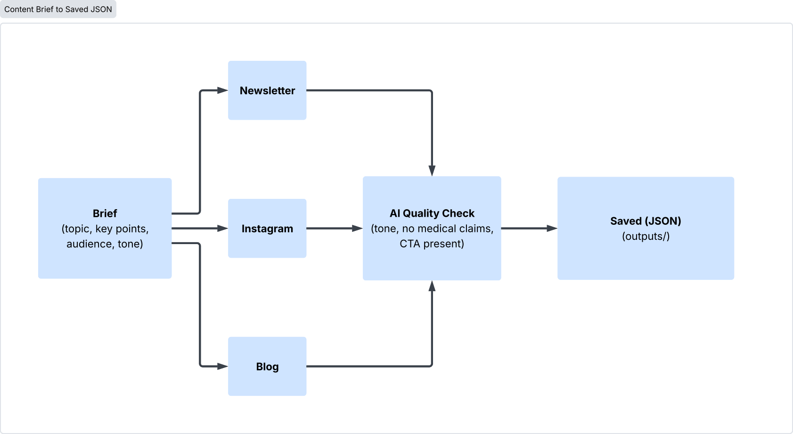

## A Content Automation Pipeline

Turns a single content brief into ready-to-publish marketing content for multiple channels automatically, with an AI quality check on every output.



## A Problem
Writing separate content for a blog, Instagram, and a newsletter for the same underlying message is repetitive manual work. The same offer or tip ends up rewritten by hand three times, and messaging quietly drifts between versions along the way

## A Solution
Give the pipeline one **Brief** (a topic, some key points, a target audience, and a tone) and it **generates all three channel versions** from it, each with its **own purpose-built AI prompt** (a blog needs different structure and length than an Instagram caption). Every generated piece is then **reviewed by a second, independent AI pass before being saved**, checking:

## Two ways to run it

**CLI**, for scripting or terminal use:

```bash
content-pipeline --topic "Sommer-Aktion: 20% auf Laser-Haarentfernung" \
                  --key-point "Nur im August gültig" \
                  --key-point "Alle drei Standorte" \
                  --audience "Bestandskunden" \
                  --tone "locker, mit Dringlichkeit"
```

Omit the flags and it prompts for each field interactively instead.

**Web UI**, a simple form + results page:

```bash
content-pipeline-web
```

Then open `http://127.0.0.1:5000`.


## Getting started

```bash
git clone https://github.com/jaysss02/ai-content.git
cd ai-content
python -m venv venv
venv\Scripts\activate          # Windows
# source venv/bin/activate     # macOS/Linux
pip install -e .
```

### Run in demo mode (no API key needed)

By default, with no `ANTHROPIC_API_KEY` set, the pipeline automatically
runs in demo mode —> using realistic canned responses instead of calling
the API, so you can see the whole thing work with zero setup:

```bash
content-pipeline-web
```

### Run in live mode

```bash
cp .env.example .env        # then add ANTHROPIC_API_KEY
content-pipeline-web
```

### Run tests

```bash
pip install -e ".[dev]"
pytest
```

All tests run in demo mode —> no API key needed, no network calls made.
