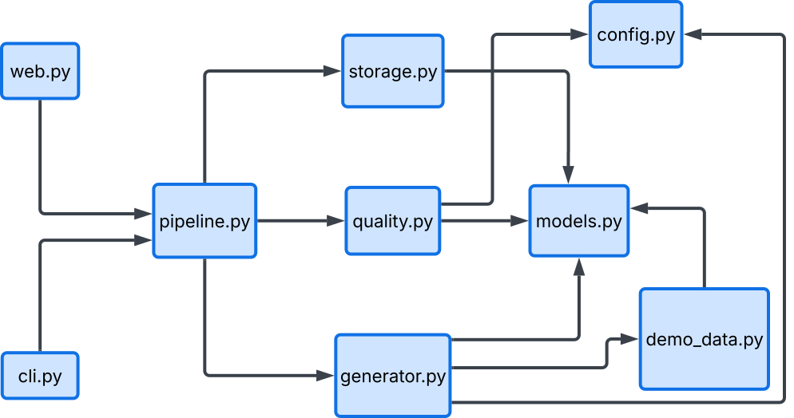

## Content Automation Pipeline

Turns a single content brief into ready-to-publish marketing content for multiple channels automatically, with an AI quality check on every output.


## Problem
Writing separate content for a blog, Instagram, and a newsletter for the same underlying message is repetitive manual work. The same offer or tip ends up rewritten by hand three times, and messaging quietly drifts between versions along the way

## Solution
Give the pipeline one **Brief** (a topic, some key points, a target audience, and a tone) and it **generates all three channel versions** from it, each with its **own purpose-built AI prompt** (a blog needs different structure and length than an Instagram caption). Every generated piece is then **reviewed by a second, independent AI pass before being saved**, checking:

- Does the tone match what was requested?
- Are there any medical or health claims beyond what's in the brief? (this
  project's example use case is a cosmetics studio, where that matters)
- Does it end with a clear call to action?

## Two ways to run it

**CLI**, for scripting or terminal use:

```bash
content-pipeline --topic "Sommer-Aktion: 20% auf Laser-Haarentfernung" \
                  --key-point "Nur im August gültig" \
                  --key-point "Alle drei Standorte" \
                  --audience "Bestandskunden" \
                  --tone "locker, mit Dringlichkeit"
```

Omit the flags and it prompts for each field interactively instead.

**Web UI**, a simple form + results page:

```bash
content-pipeline-web
```

Then open `http://127.0.0.1:5000`.


## Getting started

```bash
git clone https://github.com/jaysss02/ai-content.git
cd ai-content
python -m venv venv
venv\Scripts\activate          # Windows
# source venv/bin/activate     # macOS/Linux
pip install -e .
```

### Run in demo mode (no API key needed)

By default, with no `ANTHROPIC_API_KEY` set, the pipeline automatically
runs in demo mode —> using realistic canned responses instead of calling
the API, so you can see the whole thing work with zero setup:

```bash
content-pipeline-web
```

### Run in live mode

```bash
cp .env.example .env        # then add ANTHROPIC_API_KEY
content-pipeline-web
```

### Run tests

```bash
pip install -e ".[dev]"
pytest
```

All tests run in demo mode —> no API key needed, no network calls made.


## Project Structure


Two entry points (`web.py`, `cli.py`) -> which refers to the front end, both go through one orchestrator
(`pipeline.py`), which fans out to three workers — `generator.py`,
`quality.py`, `storage.py` — all sharing the same `models.py` for data
shapes and `config.py` for settings.

### How a brief becomes content

Following those same arrows: `generator.py` **sends the brief to Claude** with
a separate system prompt per channel (the newsletter uses **Pydantic
structured output** for its subject + body). `quality.py` then reviews each
piece in a fresh API call with no memory of writing it. `pipeline.py` ties
both together into a `ContentPackage`, and `storage.py` saves it as
timestamped JSON.

## Tech stack

Python · Claude API (`anthropic` SDK) · Pydantic (structured outputs) ·
Flask · dataclasses · pytest · argparse

## Future improvements

This is a working prototype, not a production tool — a few concrete next
steps would close that gap:

- **Direct publishing** — right now the content is just saved as in JSON file and copy-pasted elsewhere. however it doesnt push straight to Instagram API or CMS
- **In-page editing** — let someone tweak the generated text beforemarking it "ready," instead of editing outside the tool.
- **A history view** — a searchable list of everything generated, with approval status, instead of individual JSON files.
- **Accounts** — track who generated what, once more than one person uses it.
- **More channels** — Google Business posts, SEO meta descriptions.
